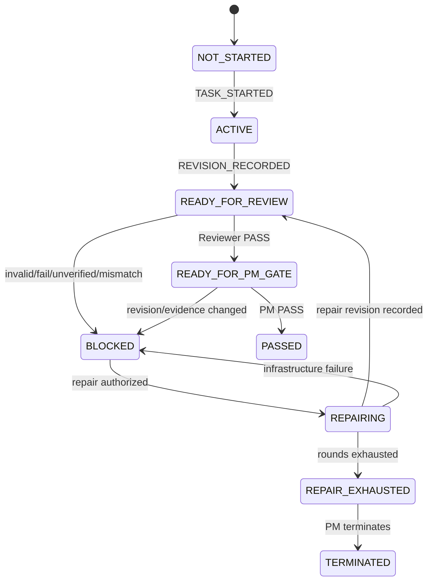
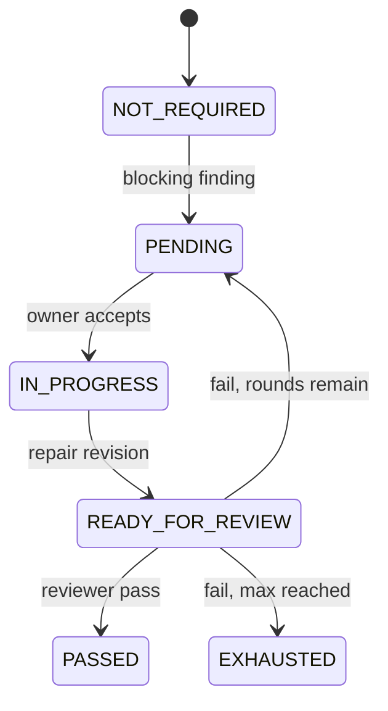
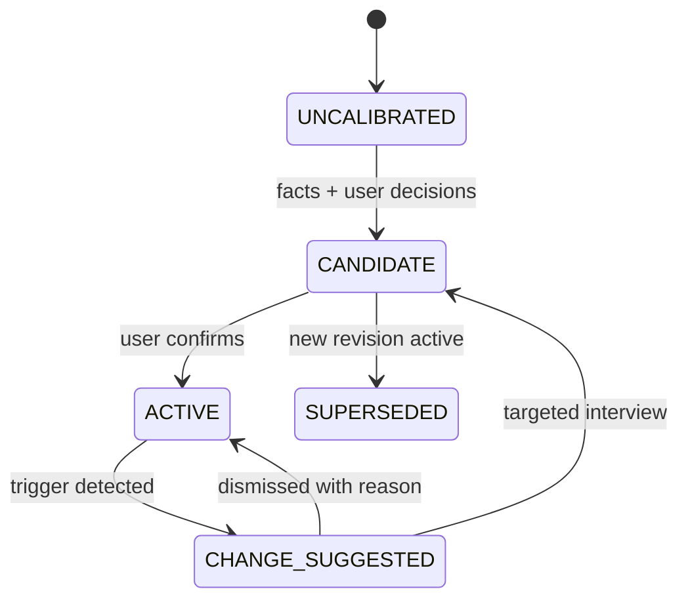

# 状态机

## Task

```mermaid
stateDiagram-v2
  [*] --> NOT_STARTED
  NOT_STARTED --> ACTIVE: TASK_STARTED
  ACTIVE --> READY_FOR_REVIEW: REVISION_RECORDED
  READY_FOR_REVIEW --> BLOCKED: invalid/fail/unverified/mismatch
  READY_FOR_REVIEW --> READY_FOR_PM_GATE: Reviewer PASS
  BLOCKED --> REPAIRING: repair authorized
  REPAIRING --> READY_FOR_REVIEW: repair revision recorded
  REPAIRING --> BLOCKED: infrastructure failure
  REPAIRING --> REPAIR_EXHAUSTED: rounds exhausted
  READY_FOR_PM_GATE --> PASSED: PM PASS
  READY_FOR_PM_GATE --> BLOCKED: revision/evidence changed
  REPAIR_EXHAUSTED --> TERMINATED: PM terminates
```

## Repair

```mermaid
stateDiagram-v2
  [*] --> NOT_REQUIRED
  NOT_REQUIRED --> PENDING: blocking finding
  PENDING --> IN_PROGRESS: owner accepts
  IN_PROGRESS --> READY_FOR_REVIEW: repair revision
  READY_FOR_REVIEW --> PASSED: reviewer pass
  READY_FOR_REVIEW --> PENDING: fail, rounds remain
  READY_FOR_REVIEW --> EXHAUSTED: fail, max reached
```

## Governance Calibration

```mermaid
stateDiagram-v2
  [*] --> UNCALIBRATED
  UNCALIBRATED --> CANDIDATE: facts + user decisions
  CANDIDATE --> ACTIVE: user confirms
  ACTIVE --> CHANGE_SUGGESTED: trigger detected
  CHANGE_SUGGESTED --> ACTIVE: dismissed with reason
  CHANGE_SUGGESTED --> CANDIDATE: targeted interview
  CANDIDATE --> SUPERSEDED: new revision active
```
